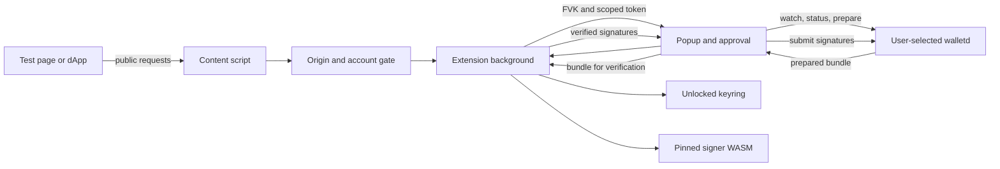

# ZKas architecture

## Architecture Overview

Background code owns ZKas derivation and signing. The visible extension popup owns daemon calls because proof preparation can outlast the background service worker's response lifetime. The popup receives the FVK and scoped wallet token; web pages receive only public address, balance/sync state, and transaction IDs. Kaspa and ZKas network settings remain distinct.

## Data Models

- `networkId` remains the Kaspa RPC network. An optional `activeChain` selects the wallet dashboard; old stored settings default to Kaspa. ZKas Mainnet requires `preview === true`, `activeChain === "zkas"`, Kaspa `networkId === mainnet`, and a separate `local:zkas-experimental-enabled` value that is not `false`. A missing flag preserves pre-upgrade Experimental choices; the toggle writes an explicit flag thereafter. Disabling it first writes `false` to the separate key, then selects Kaspa, so a stale whole-settings write from another extension window cannot reauthorize ZKas. The picker, routes, and background key service apply the gate; ZKas testnet remains unsupported in the picker until a validated signer exists.
- Per-network daemon URL with no default. HTTPS is required except loopback development; optional host permission is requested from a user gesture.
- Public ZKas account address bound to Kastle wallet ID and account index. Phrase-derived seeds are not persisted. A newly imported spending seed is its own encrypted `zkasSeed` wallet secret and public wallet entry; legacy Kaspa private-key wallets with an attached seed remain readable. Neither route derives a ZKas seed from the Kaspa private key.
- Balance in decimal-string sompi with sync and missing-history flags; all payment amounts are `bigint`.
- Account/network-scoped wallet token derived locally with a domain-separated HMAC from the derived seed; never returned to a dApp.
- A keyring session version invalidates in-flight operations after lock, unlock, reset, or password migration.
- Wallet-secret changes use a serialized read-modify-write path. A repeated spending seed, including one attached by an older build, is rejected so a payment-recovery record cannot be bypassed with a second wallet ID. Wallet add/remove and password migration cannot overwrite it with an older array snapshot.
- A local account-scoped payment record stores only selection, status, time, and optional transaction ID. It blocks another send after interrupted preparation or uncertain submission until the user checks history and clears the warning.

## API Design

- Internal: selected account, status/balance, send. Recheck selected wallet/account/network before submitting.
- Page: `zkas:connect`, `zkas:get_account`, `zkas:get_balance`, `zkas:send`. Reads need a connected origin; send needs a fresh visible approval.
- `zkas:send` accepts a ZKas address, integer sompi as a decimal string, and explicit max fee in sompi; returns a txid and the daemon-reported fee. The WASM verifies the actual bundle fee against the ceiling, but does not expose that fee to JavaScript. An uncertain submission requires history reconciliation before retry.
- Walletd: `POST /api/wallet/watch`, `GET /api/status`, `GET /api/wallet/balance`, `GET /api/wallet/history`, `POST /api/wallet/prepare`, `POST /api/wallet/submit`. Never use custodial `create/import/reveal/send`.

## Component Breakdown

- Pinned WASM and wrapper: derive account seed, address, FVK; call only verified payment signing.
- Typed daemon adapter: strict URL/network/response checks, full-payment amount and fee reconciliation.
- Background service: keyring and account guard, signer, browser handlers restricted to extension-page senders.
- Visible popup client: daemon transport and payment orchestration; rechecks account, daemon permission, and network before submit.
- Bounded daemon requests: status/history reads have a 30-second ceiling, proof preparation six minutes, and submission 90 seconds. A failed or timed-out submission remains uncertain.
- Popup: ZKAS asset, receive, send/confirm/result, daemon configuration, dApp approval.
- Local test page: discovery, connect, read probes, optional approved send.

## Design Decisions

- Direct daemon adapter because the upstream SDK is not published to npm.
- Existing ordinary BIP39 phrase with upstream ZIP-32 account derivation keeps backup and account switching familiar. The switcher shows Kaspa wallets on Kaspa networks and eligible phrase plus spending-seed wallets on ZKas Mainnet. A spending seed imports through Import Wallet independently of the selected phrase and needs its own backup. Passphrase and Ledger accounts fail closed on ZKas.
- First version requires one full transaction. A fragmented payment fails before signing, avoiding ambiguous partial delivery.
- Daemon choice is explicit because its operator can observe activity through the FVK.

## Non-Functional Requirements

- Never log phrase, seed, FVK, token, bundle, signatures, or disclosure.
- User-visible fee ceiling is rechecked by WASM from the bundle's value balance.
- Incomplete history or sync is prominent, never shown as a final balance.
- Long remote proofs show progress and permit only one in-flight payment per selected account; interrupted and uncertain sends persist across popup and background restarts.
- Build and packaging gates check WASM and executable JS hashes plus ZKas genesis bytes.
